# Finclaw需求文档

## 1. 引言

### 1.1 目的

​		本文档描述了Finclaw平台系统的功能需求和非功能需求。Finclaw平台是一个基于联邦学习的小微企业信用风险管理系统，核心目标是为金融机构客户提供去中心化的联邦学习数据加密共享框架、高效先进的小微企业信用评级算法预测和最优化信贷策略，并为贷款小微企业提供集成的信用评级服务和基于花旗API的借款服务。

​		此文档将作为开发团队后续进行开发实现与验证工作的依据。

### 1.2 范围

​		本文档描述了Finclaw平台系统的需求说明，涉及的功能包括各个身份的用户的登录注册，认证资料上传，账户管理；银行工作人员的项目管理，信用评级策略管理，浏览贷款申请，发放贷款，同时使用花旗API为花旗银行接入了借款服务；数据提供方的服务器信息管理，项目管理；小微企业的申请借款，借贷情况查看，接受贷款；以及平台工作人员的资料认证、人员管理和使用监控。

### 1.3 参考文献

1. 丁二玉,刘钦.《计算与软件工程(卷二)》
2. 骆斌.《需求工程软件建模与分析》
3. IEEE标准

### 1.4 文档组织

​		本文档按照用户类别进行组织，共列出了四类用户（银行工作人员、数据提供方、小微企业、平台工作人员）的用户需求、用例描述以及各自模块所涉及的前后端交互接口，并对开发中的对外接口以及性能需求、约束、质量属性等做出了规定。

## 2. 总体描述

### 2.1 业务需求

BR1：结合最新联邦学习算法研究，实现多个金融机构和数据机构加密共享数据训练模型的全过程以及小微企业的信用评级全过程。

BR2：实现银行在同样的金额下，以不同投资方式为小微企业进行贷款的风险评级+收益评级，为银行提供选择。

BR3：研究在新冠疫情下，小微企业通过花旗API 进行贷款业务的方法。

BR4：研究减少小微企业融资成本困境，提高自身信用评级的方法。

BR5：针对大数据情况下的系统设计优化。

### 2.2 项目功能

Finclaw平台主要实现的功能有：

FE1：不同角色的用户可以在平台上进行注册并由平台管理人员进行相应的身份认证。

FE2：银行工作人员可以在平台上创建、修改与管理联邦学习项目。

FE3：数据提供方可自由加入不同的联邦学习项目中为训练项目提供数据。

FE4：小微企业主可以在平台上进行贷款申请，银行可以通过平台看到各个小微企业的贷款。

FE5：平台工作人员可以查看各用户在平台上的使用情况并对存在可疑行为的用户进行账号封禁。

### 2.3 用户特征

|     用户     | 特征                                                         |
| :----------: | ------------------------------------------------------------ |
|     银行     | 对小微企业进行高效的贷款的风险评级与收益评级，完成贷款的发放，拓宽贷款业务的渠道通路 |
|  数据提供方  | 在提供数据数据的同时，保护自身数据不被暴露，解决数据孤岛的问题 |
|   小微企业   | 凭借自身的信用尽可能高效的申请到足够的借款                   |
| 平台工作人员 | 对各个身份的用户上传的认证资料进行审核，以及对平台用户的使用监控和管理 |

### 2.4 约束

CON1：系统需要有web端界面。

CON2：在开发中，开发人员要提交酒店预定系统用例文档、软件需求规格说明文档、软件体系结构描述文档、软件详细设计描述文档以及测试报告。

CON3：项目使用持续集成的方式进行开发。

CON4：项目将使用Spring Boot和MyBatis作为后端框架，使用Vue进行前端开发。

### 2.5 假设与依赖

AE1：超出本系统范围产生的异常将由人工介入处理。

AE2：我们的服务器能够处理所有潜在用户的请求，并能够存储所有进行过埋点的数据。

AE3：网络畅通，客户端与服务器通信时，不会发生连接断开等网络异常。

## 3. 详细需求描述

### 3.1 对外接口


#### 3.1.1 平台主页

##### 3.1.1.1 主页


##### 3.1.1.2 项目详情页


##### 3.1.1.3 注册


##### 3.1.1.4 登录
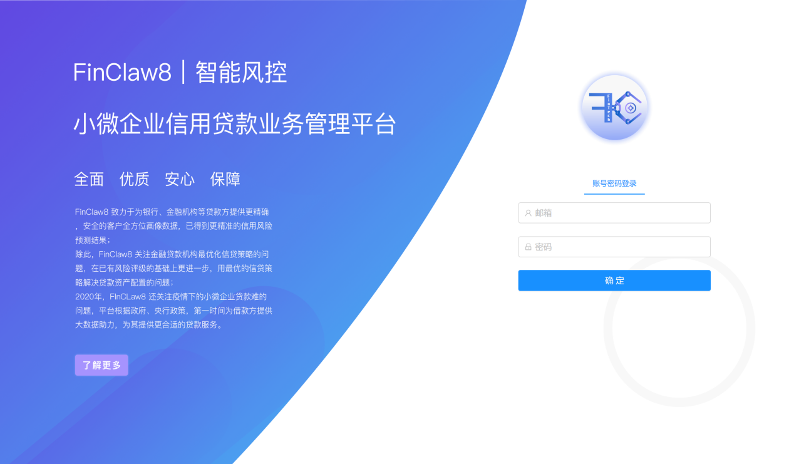

##### 3.1.1.5 提交认证材料


#### 3.1.2 平台管理员

##### 3.1.2.1 账号注册审核

##### 3.1.2.2 账号管理

##### 3.1.2.3 使用监控


#### 3.1.3 银行
##### 3.1.3.1 项目浏览
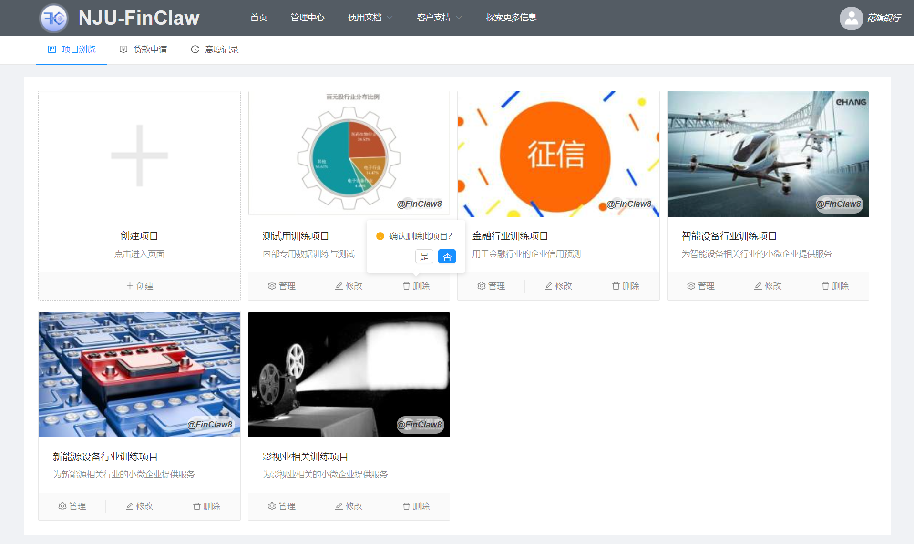
##### 3.1.3.2 创建项目


##### 3.1.3.3 修改项目
##### 3.1.3.4 删除项目
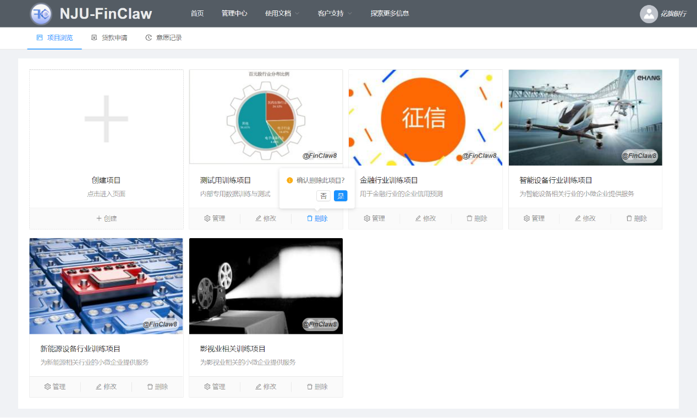
##### 3.1.3.5 处理贷款申请
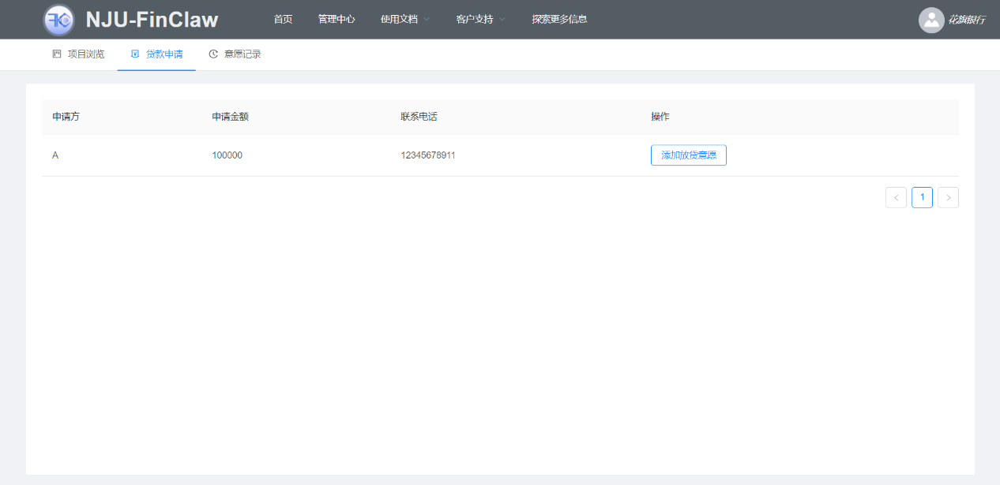

##### 3.1.3.6 查看意愿记录
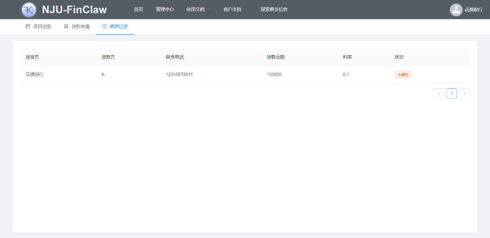
##### 3.1.3.7 项目数据展示

##### 3.1.3.8 项目权限管理

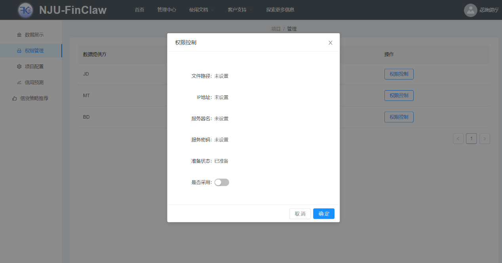
##### 3.1.3.9 项目部署、上传、训练

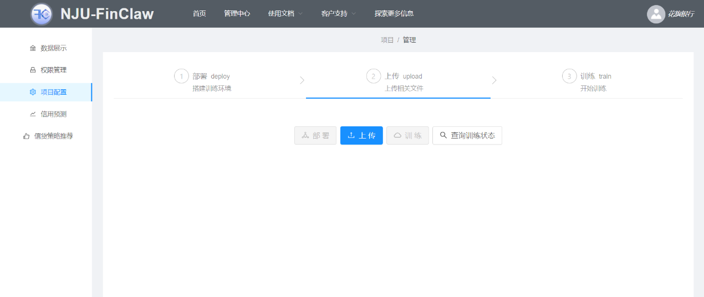

##### 3.1.3.10 预测企业信用并推荐放贷策略

##### 3.1.3.11 银行信贷策略推荐
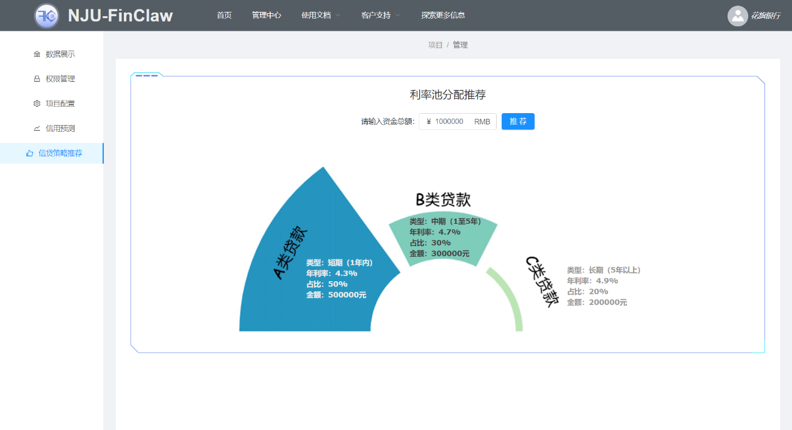
#### 3.1.4 数据提供方

##### 3.1.4.1 加入项目


##### 3.1.4.2 上传服务器信息

##### 3.1.4.3 准备训练

##### 3.1.4.4 退出项目


#### 3.1.5 小微企业

##### 3.1.5.1 贷款申请
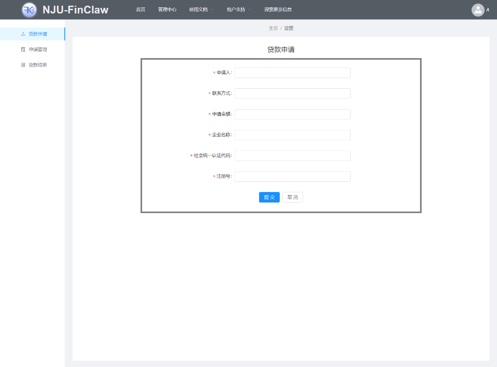
##### 3.1.5.2 申请管理
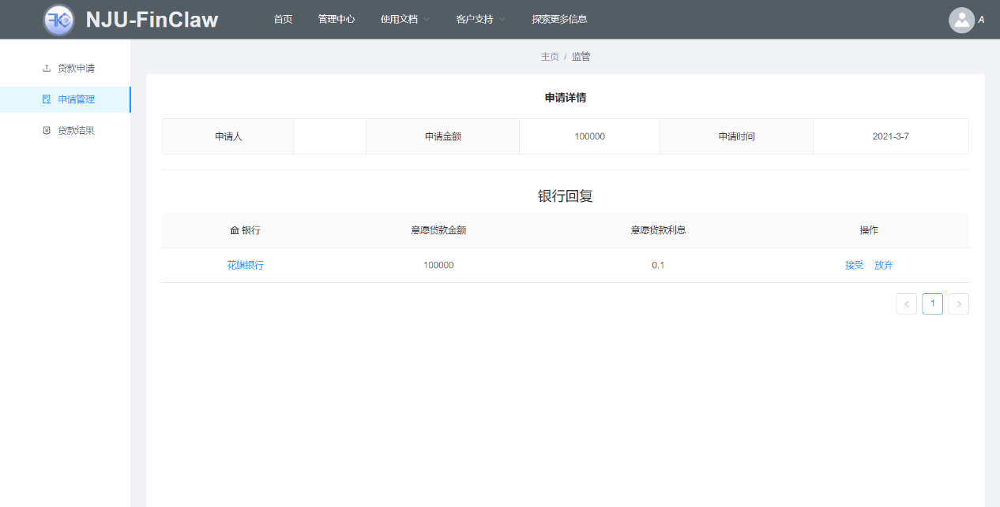
##### 3.1.5.3 贷款结果
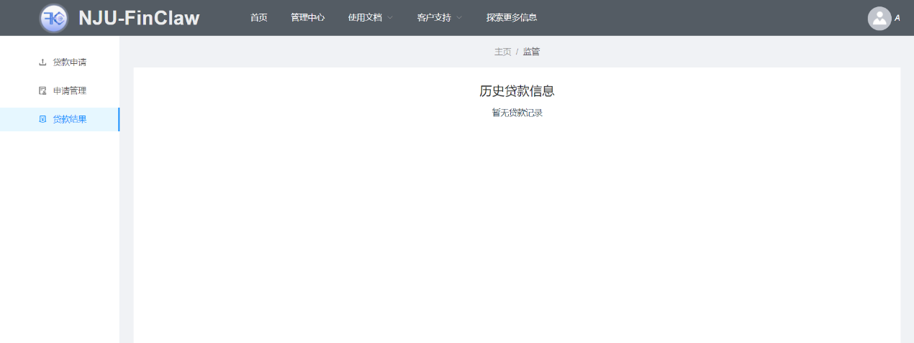


### 3.2 用例描述

#### 3.2.1 用例图


#### 3.2.2 用例列表

##### 3.2.2.1 银行

1. 项目管理
2. 信用评级策略管理
3. 浏览贷款申请
4. 发放贷款

##### 3.2.2.2 数据提供方

1. 服务器信息管理
2. 项目管理

##### 3.2.2.3 借款小微企业

1. 申请借款
2. 借贷情况查看
3. 接受贷款

##### 3.2.2.4 平台工作人员

1. 资料认证
2. 使用监控

##### 3.2.2.5 公共部分

1. 登录注册
2. 认证资料上传
3. 账户管理

#### 3.2.3 详细用例描述

##### 3.2.3.1 银行

###### 3.2.3.1.1 项目管理

- ID：AUR1

- 名称：项目管理

- 优先级：高

- 参与者：银行工作人员

- 触发条件：银行工作人员选择进行项目管理

- 前置条件：银行工作人员已经登录并被授权

- 后置条件：系统记录项目更新后的情况，并在平台上进行更新

- 正常流程：

  1. 银行工作人员选择进行项目管理
  2. 系统展示所有已有的项目
  3. 银行工作人员选择创建新的项目
  4. 系统跳转至创建项目页面
  5. 银行工作人员填写项目基本信息，并提交
  6. 系统审核信息完整性，存储并在平台发布创建的项目

- 扩展流程：

  1a. 银行工作人员选择进行项目信息修改
  	1. 系统展示选择修改的项目的原有信息
  	2. 银行工作人员修改项目信息并提交
  	3. 跳转至正常流程6

  1b. 银行工作人员选择删除某个项目

  1. 系统将项目从平台中删除，并通知所有已经参与该项目的合作方

  6a. 工作人员填写的信息不完整

  1. 系统提示信息缺失，并要求用户继续填写，跳转至正常流程5

- 业务规则：

  BR1：创建项目需要填写的基本信息包含项目名称、项目描述、报名截止时间

- 特殊需求：无

###### 3.2.3.1.2 信用评级策略管理

- ID：AUR2

- 名称：信用评级策略管理

- 优先级：高

- 参与者：银行工作人员

- 触发条件：银行工作人员选择进行信用评级策略管理

- 前置条件：银行工作人员已经登录并被授权

- 后置条件：系统保存更新后的信用评级策略

- 正常流程：

  1. 银行工作人员选择进行信用评级策略管理
  2. 系统展示已有的信用评级策略
  3. 银行工作人员修改信用评级策略具体信息并提交
  4. 系统保存修改后的信用评级策略

- 扩展流程：

  1a. 银行工作人员选择的是创建新的信用评级策略

  1. 系统展示一个新的信用评级策略表单，回到正常流程3

  4a. 银行工作人员填写的信息不完整

  1. 系统提示信息不完整并要求银行工作人员重新填写，回到正常流程3

- 业务规则：无

- 特殊需求：无

###### 3.2.3.1.3 浏览贷款申请

- ID：AUR3

- 名称：浏览贷款申请

- 优先级：高

- 参与者：银行工作人员

- 触发条件：银行工作人员选择浏览所有贷款申请

- 前置条件：银行工作人员已经登录并被授权

- 后置条件：无

- 正常流程：

  1. 银行工作人员选择进行贷款申请
  2. 系统展示平台上的所有贷款申请以及申请贷款的小微企业的信用评分
  3. 银行工作人员选择查看某个贷款申请的小微企业的情况
  4. 系统展示该小微企业的具体情况

- 扩展流程：

  1a. 银行工作人员选择按照申请贷款的小微企业的信用评分的高低进行排序

  1. 系统将申请按照小微企业的信用评分排序进行展示

  1b. 银行工作人员选择按照申请贷款的金额数目进行排序

  1. 系统将申请按照贷款额度进行排序后展示

- 业务规则：无

- 特殊需求：无

###### 3.2.3.1.4 发布贷款

- ID：AUR4

- 名称：发布贷款

- 优先级：高

- 参与者：银行工作人员

- 触发条件：银行工作人员选择进行贷款发布

- 前置条件：银行工作人员已经登录并被授权

- 后置条件：系统将银行发放贷款的信息发送给申请贷款的小微企业

- 正常流程：

  1. 银行工作人员选择为某个贷款申请发放贷款
  2. 系统提示银行工作人员输入密码进行身份验证
  3. 银行工作人员输入密码
  4. 系统验证成功后，将发放贷款的信息发送给申请贷款的小微企业

- 扩展流程：

  4a. 若银行工作人员输入的密码错误

  1. 系统提示密码错误，并要求银行工作人员重新输入，若错误超过5次，则冻结账号

- 业务规则：无

- 特殊需求：无

##### 3.2.3.2 数据提供方

###### 3.2.3.2.1 服务器信息管理

- ID：BUR1

- 名称：服务器信息管理

- 优先级：高

- 参与者：各个数据提供方

- 触发条件：数据提供方进入服务器信息管理界面

- 前置条件：该数据提供方已经通过了资料认证

- 后置条件：更新该数据提供方的服务器信息

- 正常流程：

  1. 数据提供方进入服务器信息管理界面
  2. 系统显示该数据提供方填写的服务器资料 
  3. 数据提供方重新编辑自己的服务器信息，并点击确认
  4. 保存并更新该数据提供方的服务器信息

- 扩展流程：

  3a. 填写的服务器信息不符合数据规范
	4. 系统提示修改失败，要求重新规范填写
3b. 服务器信息必填项未填写
	4. 系统提示修改失败，提示填写必要的服务器信息

- 业务规则：无
- 特殊需求：无

###### 3.2.3.2.2 项目管理

- ID：BUR2

- 名称：项目管理

- 优先级：高

- 参与者：数据提供方

- 触发条件：数据提供方进入项目管理界面

- 前置条件：该数据提供方已经通过了资料认证

- 后置条件：系统更新该数据提供方参与项目的情况

- 正常流程：

  1. 数据提供方进入项目管理界面
  2. 系统显示平台上银行发起的各个训练项目的信息
  3. 数据提供方选择自己要参与的项目并确认参加
  4. 系统检查该数据提供方的资质和权限，将其纳入项目参与者，自动进入服务器信息管理

- 扩展流程：

  3a. 数据提供方选择退出自己参与的某个项目

    4. 系统将其从项目参与者中排除

  4a. 该数据提供方资质和权限不符合项目要求

  ​	5. 系统提示数据提供方不符合相关资质，项目参与失败


##### 3.2.3.3 借款小微企业

###### 3.2.3.3.1 申请借款

- ID：CUR1

- 名称：申请借款

- 优先级：高

- 参与者：借款小微企业、银行

- 触发条件：小微企业用户申请借款

- 前置条件：小微企业用户已经注册并登陆，且身份认证通过了平台审核

- 后置条件：系统保存企业的申请记录

- 正常流程：

  1. 小微企业用户在[主页]点击[借款]
  2. 系统进入可借款银行页面
  3. 小微企业用户选择要借款的银行
  4. 系统进入银行的借贷详情页面
  5. 小微企业查看详情后，选择借款额度
  6. 系统提交借款申请给目标银行

- 扩展流程：

  ​		5a.小微企业用户了解详情后放弃在此银行借贷

  ​			1.系统返回可借款银行页面

- 业务规则：

  BR1：如果小微企业的信用评分低于银行要求，则不能向该银行发起借款申请。

  BR2：小微企业的借款申请需要在15日内处理，逾期未处理的视为过期申请，状态变为无效。

- 特殊需求：无

###### 3.2.3.3.2 借贷情况查看

- ID：CUR2

- 名称：借贷情况查看

- 优先级：高

- 参与者：借款小微企业

- 触发条件：小微企业用户查看自身贷款情况

- 前置条件：小微企业用户已经登陆

- 后置条件：无

- 正常流程：

  1. 小微企业用户在[我的]页面点击[借贷情况]
  2. 系统进入借贷情况页面
  3. 小微企业用户查看某次借贷详细情况
  4. 系统返回借贷详情
  5. 小微企业用户选择[返回]或关闭窗口
  6. 系统返回上一级页面或退出

- 扩展流程：

  ​		无

- 业务规则：

  BR1：借贷记录中应保持业务所需要的所有字段信息

- 特殊需求：

  SR1：小微企业用户需要看到记录中借贷、还款的状态

###### 3.2.3.3.3 接受贷款

- ID：CUR3

- 名称：接受贷款

- 优先级：高

- 参与者：借款小微企业、银行

- 触发条件：银行同意小微企业的贷款申请

- 前置条件：小微企业用户已经登陆

- 后置条件：系统记录此次贷款操作

- 正常流程：

  1. 小微企业用户查看贷款申请
  2. 系统进入贷款申请详情页
  3. 小微企业用户确认接受贷款
  4. 系统弹出窗口进行二次确认
  5. 小微企业用户点击确认
  6. 系统执行贷款操作，并向小微企业用户和银行发送贷款成功提醒，系统记录此次贷款

- 扩展流程：

  ​		3a.小微企业用户拒绝接受贷款

  ​			1.系统弹出窗口进行二次确认

  ​			2.小微企业用户点击[确定]

  ​			3.系统执行取消贷款操作，并向小微企业用户和银行发送				取消贷款提醒

  ​		5a.小微企业用户点击取消

  ​			1.系统回到贷款申请详情页

- 业务规则：

  BR1：接受贷款后，银行需要在3个工作日内将资金打到用户的账号中

  BR2：用户需在规定日期前归还贷款，否则每日需要加收贷款总额1%的超期罚款

- 特殊需求：

  SR1：系统自动计算当前借贷项中需要还款的金额

##### 3.2.3.4 平台工作人员

###### 3.2.3.4.1 资料认证

- ID：DUR1

- 名称：资料认证

- 优先级：高

- 参与者：平台工作人员

- 触发条件：平台工作人员进入资料认证界面

- 前置条件：银行资料已提交

- 后置条件：更新银行账号的认证状态

- 正常流程：

  1. 平台工作人员进入资料认证界面
  2. 系统显示待认证的银行信息列表
  3. 平台工作人员核实认证信息
  4. 平台工作人员更改银行的认证状态为“已认证”
  5. 系统保存修改并更新显示待认证的银行信息列表

- 扩展流程：

  3a. 银行提供的认证信息不符合要求

  4. 平台工作人员更改银行的认证状态为“认证失败”

- 业务规则：无

- 特殊需求：无

###### 3.2.3.4.2 使用监控

- ID：DUR2

- 名称：使用监控

- 参与者：平台工作人员

- 触发条件：平台工作人员进入使用监控界面

- 前置条件：无

- 后置条件：系统显示用户操作记录

- 正常流程：

  1. 平台工作人员进入使用监控界面
  2. 系统显示操作记录列表

- 扩展流程：

  3a. 平台工作人员筛选操作类型

  4. 系统显示属于对应类型的操作记录

  3b. 平台工作人员筛选操作日期

  4. 系统显示在所选时间范围内的操作记录


##### 3.2.3.5 公共部分

###### 3.2.3.5.1 登录注册

- ID：1

- 名称：登录注册

- 优先级：高

- 参与者：银行、数据提供方、借款小微企业

- 触发条件：使用者选择登录注册

- 前置条件：无

- 后置条件：系统记录用户的登录注册信息

- 正常流程：

  1. 使用者选择登录注册
  2. 使用者注册，选择自己想要注册的账户的类型
  3. 使用者输入注册信息
  4. 使用者进行认证资料的上传
  5. 使用者认证成功，注册完成
  6. 使用者登录
  7. 使用者登录成功，进入主界面

- 扩展流程：

  2a. 使用者已经注册

  1. 跳转到正常流程6

  5a. 使用者认证失败

  1. 跳转到正常流程4，重新进行认证资料的上传

  7a. 使用者登录失败

  1. 跳转到正常流程6，重新进行登录

- 业务规则：

  BR1：登录和注册均需要验证码

  BR2：注册的账户类型包括银行、数据提供方、借款小微企业

- 特殊需求：无

###### 3.2.3.5.2 认证资料上传

- ID：2

- 名称：认证资料上传

- 优先级：高

- 参与者：银行、数据提供方、借款小微企业、平台工作人员

- 触发条件：使用者选择上传认证资料

- 前置条件：无

- 后置条件：系统记录认证资料

- 正常流程：

  1. 使用者选择上传认证资料
  2. 使用者上传对应所需的认证资料
  3. 审核工作人员对使用者上传的认证资料进行审核
  4. 审核通过，认证成功，使用者完成认证资料上传

- 扩展流程：

  4a. 审核未通过

  1. 跳转到正常流程2，使用者重新上传认证资料

- 业务规则：

  BR1：认证资料包括

- 特殊需求：无

###### 3.2.3.5.3 账户管理

- ID：3

- 名称：账户管理

- 优先级：高

- 参与者：银行、数据提供方、借款小微企业

- 触发条件：使用者选择账户管理

- 前置条件：无

- 后置条件：系统记录使用者对账户信息的修改

- 正常流程：

  1. 使用者选择账户管理
  2. 使用者选择自己想要进行修改的内容进行管理
  3. 系统保存使用者对信息的修改

- 扩展流程：

  2a. 使用者选择修改密码

  1. 使用者输入旧密码

  2. 旧密码验证成功，使用者输入新密码并二次确认

     2i. 输入的旧密码不正确

     1. 跳转到扩展流程2a，使用者重新进行密码的修改

  2b. 使用者选择修改联系方式

  1. 使用者输入新的联系方式并确认

- 业务规则：无

- 特殊需求：无

#### 3.2.4 系统顺序图 ==TODO 转英文==

##### 3.2.4.1 银行

###### 3.2.4.1.1 项目管理


###### 3.2.4.1.2 信用评级策略管理


###### 3.2.4.1.3 浏览贷款申请


###### 3.2.4.1.4 发布贷款


##### 3.2.4.2 数据提供方

###### 3.2.4.2.1 服务器信息管理


###### 3.2.4.2.2 项目管理


##### 3.2.4.3 借款小微企业

###### 3.2.4.3.1 申请贷款


###### 3.2.4.3.2 借贷情况查看


###### 3.2.4.3.3 接受贷款


##### 3.2.4.4 平台工作人员

###### 3.2.4.4.1 资料认证


###### 3.2.4.4.2 使用监控


##### 3.2.4.5 公共部分

###### 3.2.4.5.1 登录注册

 


###### 3.2.4.5.2 认证资料上传


###### 3.2.4.5.3 账户管理 


### 3.3 前后端接口

#### 3.3.1 VO&PO包

**特别说明：**

- *Form 用于填写表单的对象，例如注册或提交信息
- *VO 用于返回某个对象的信息
- *PO用于与数据库交互

##### 3.3.1.1 银行用例

###### 3.3.1.1.1 项目管理相关

**ProjectForm**

```java
public class ProjectForm{
	private Integer userID;//创建者的ID
    private String projectName;
    private String description;
    private Timestamp startTime;
    private Timestamp endTime;
}
```

**ProjectVO**

```java
public class ProjectVO{
	private Integer projectID;
	private Integer userID;//创建者的ID
    private String projectName;
    private String description;
    private ProjectStatus status;
    private Timestamp startTime;
    private Timestamp endTime;
}
```

**Project**

```java
public class Project{
	private Integer projectID;
	private Integer userID;//创建者的ID
	private Integer modelID;//一个项目对应一个模型
    private String projectName;
    private String description;
    private ProjectStatus status;
    private Timestamp startTime;
    private Timestamp endTime;
}
```

**AttendanceVO**

```java
//记录一条项目参与记录
public class AttendanceVO{
	private Integer userID;//因为现在默认一个银行/数据提供方只有一个账号，就直接用userID来标识一个数据提供方了
	private Integer projectID;
	private boolean isChosen;//银行是否选择这个数据提供方的数据训练
	private boolean isReady;//数据提供方是否准备好数据
}
```

**Attendance**

```java
public class Attendance{
	private Integer userID;
	private Integer projectID;
	private boolean isChosen;
	private boolean isReady;
}
```

###### 3.3.1.1.2 联邦学习相关

**Model**

```java
public class Model{
	private Integer modelID;
	private String mid;
	private String modelVerion;//和mid一起标识当前版本模型
	private String modelName;//在load_bind时需要指明，predict时是使用mname来进行标识
}
```

###### 3.3.1.1.3 浏览贷款申请相关

见3.3.1.1.1

###### 3.3.1.1.4 放贷相关

**LendingForm**

```java
public class LendingForm{
	private Integer bankID;//银行的userID
	private Integer lenderID；//贷款的小微企业的userID
	private String bankName;
	private double amount;//意愿贷款数额
	private double interestRate;//年利率
	private String phoneNumber;//银行经理联系方式
	private String description;//贷款说明
}
```

**LendingHistoryVO**

```java
public class LendingHistoryVO{
	private Integer lendingHistoryID;
	private Integer bankID;//银行的userID
	private Integer lenderID；//贷款的小微企业的userID
	private String bankName;
	private double amount;//意愿贷款数额
	private double interestRate;//年利率
	private String phoneNumber;
	private boolean hasDealt;//借款人完成借款时置为true
}
```

**LendingHistory**

```java
public class LendingHistory{
	private Integer lendingHistoryID;
	private Integer bankID;//银行的userID
	private Integer lenderID；//贷款的小微企业的userID
	private String bankName;
	private double amount;//意愿贷款数额
	private double interestRate;//年利率
	private String phoneNumber;
	private boolean hasDealt;//借款人完成借款时置为true
}
```

##### 3.3.1.2 数据提供方用例

###### 3.3.1.2.1 服务器信息相关

**serverInfoForm**

```java
//每次参加项目都要填写服务器信息，因为一个用户可能用不同服务器参加不同项目
public class serverInfoForm{
	private Integer userID;
	private Integer projectID;
	private String ipAddress;
    private String serverName;
    private String serverPassword;
    private String filePath;//数据提供方数据存放位置
}
```

**serverInfoVO**

```java
public class serverInfoVO{
	private Integer userID;
	private Integer projectID;
	private String ipAddress;
    private String serverName;
    private String serverPassword;
    private String filePath;
}
```

**serverInfo**

```java
public class serverInfo{
    private Integer serverInfoID;//一台服务器只能用一个ID参与一个项目，所以要用serverInfoID来标识
	private Integer userID;
	private Integer projectID;
	private String ipAddress;
    private String serverName;
    private String serverPassword;
    private String filePath;
}
```

##### 3.3.1.3 小微企业用例

###### 3.3.1.3.1 借贷相关

**LoanApplicationForm**

```java
public class LoanApplicationForm{
	private Integer userID;
	private double amount;//预期借款额
	private String phoneNumber;//贷款人联系电话
	private String certificationCode;//社会统一认证代码
	private String registrationCode;//注册号
	private String companyName;
}
```

**LoanApplicationVO**

```java
public class LoanApplicationVO{
	private Integer loanApplicationID;
	private Integer userID;
	private double amount;//预期借款额
	private String phoneNumber;//贷款人联系电话
	private String certificationCode;//社会统一认证代码
	private String registrationCode;//注册号
	private String companyName;
	private boolean hasDealt;//借款人完成借款时置为true
}
```

**LoanApplication**

```java
public class LoanApplication{
	private Integer loanApplicationID;
	private Integer userID;
	private double amount;//预期借款额
	private String phoneNumber;//贷款人联系电话
	private String certificationCode;//社会统一认证代码
	private String registrationCode;//注册号
	private String companyName;
	private boolean hasDealt;//借款人完成借款时置为true
}
```

###### 3.3.1.3.2 放贷情况查看相关

与1.1.4相同

###### 3.3.1.3.3 接受贷款

与1.1.4相同

##### 3.3.1.4 平台工作人员用例

###### 3.3.1.4.1 资料认证相关

参考文件处理和登录功能

##### 3.3.1.5 公共部分用例

###### 3.3.1.5.1 登录注册相关

**UserLoginForm**

```java
public class UserLoginForm {
    private String email;
    private String password;
}
```

**UserRegisterForm**

```java
public class UserRegisterForm {
    private String email;
    private String password;
    private String username;
    private String phoneNumber;
    private UserType role;//希望以什么身份注册
}
```

**UserVO**

```java
public class UserVO {
    private Integer userID;
    private String email;
    private String password;
    private String username;
    private String phoneNumber;
    private UserType role;
}
```

**User**

```java
public class User {
    private Integer userID;
    private String email;
    private String password;
    private String username;
    private String phoneNumber;
    private UserType role;
}
```

###### 3.3.1.5.2 账户管理相关

**UserForm**

```java
public class UserForm {
    private String email;
    private String username;
    private String phoneNumber;
}
```

#### 3.3.2 Controller包设计

**统一说明**

- 建议键值放在路径中传参，且放在路径最后；
  - 示例：**url:** /api/account/getUserInfo/{userID}
- 其余信息通过RequestParam和RequestBody等传递

##### 3.3.2.1 AccountController

###### 3.3.2.1.1 登陆

**url:** /api/account/login

```java
public ResponseVO login(@RequestBody UserLoginForm userLoginForm);
```

###### 3.3.2.1.2 注册

**url:** /api/account/register

```java
public ResponseVO register(@RequestBody UserRegisterForm userRegisterForm);
```

###### 3.3.2.1.3 获取个人信息

**url:** /api/account/getUserInfo/{userID}

```java
public ResponseVO getUserInfo(@PathVariable int userID);
```

###### 3.3.2.1.4 修改个人信息

**url:** /api/account/updateUserInfo/{usreID}

```java
public ResponseVO updateUserInfo(@PathVariable int userID,@RequestBody UserForm userForm);
```

###### 3.3.2.1.5 修改个人密码

**url:** /api/account/udpatePassword/{userID}

```java
public ResponseVO updatePassword(@PathVariable int userID, @RequestParam String oldPassword, @RequestParam String newPassword);
```

###### 3.3.2.1.6 认证身份

用户注册后是非认证状态，只能使用最基本功能，上传资料管理员认证通过后授予身份认证

**url:** /api/account/registerIdentity/{userID}

```java
public ResponseVO registerIdentity(@PathVariable int userID,@RequestParam int role);
```

###### 3.3.2.1.7 获取所有用户

**url:** /api/account/getAllUsers

```java
public ResponseVO getAllUsers();
```

###### 3.3.2.1.8 获取所有未注册用户

**url:** /api/account/getUnauthorizedUsers

```java
public ResponseVO getUnauthorizedUsers();
```

##### 3.3.2.2 ProjectController

###### 3.3.2.2.1 添加项目

**url:** /api/project/addProject

```java
public ResponseVO addProject(@RequestBody ProjectForm projectForm);
```

###### 3.3.2.2.2 删除项目(不变)

**url:** /api/project/deleteProject

```java
public ResponseVO deleteProject(@RequestParam Integer projectID);
```

根据项目的ID来删除某一个项目

###### 3.3.2.2.3 修改项目信息

**url:** /api/project/modifyProject/{projectID}

```java
public ResponseVO modifyProject(@PathVariable int projectID, @RequestBody ProjectForm projectForm);
```

###### 3.3.2.2.4 查看所有项目

**url:** /api/project/getAllProjectInfo

```java
public ResponseVO getAllProject();
```

###### 3.3.2.2.5 查看某个项目的信息

**url:** /api/project/getProjectInfo/{projectID}

```java
public ResponseVO getProjectInfo(@PathVariable Integer projectID);
```

##### 3.3.2.3 AttendanceController

###### 3.3.2.3.1 加入项目 

**url:** /api/cooperation/attendProject/{projectID}/{cooperationID}

```java
public ResponseVO attendProject(@PathVariable Integer projectID, @PathVariable Integer cooperationID) 
```

###### 3.3.2.3.2 退出项目 

**url:** /api/cooperation/quitProject/{projectID}/{cooperationID}

```java
public ResponseVO quitProject(@PathVariable Integer projectID, @PathVariable Integer cooperationID)
```

###### 3.3.2.3.3 更改服务器信息

**url:** /api/cooperation/updateServerInfo

```java
public ResponseVO updateServerInfo(@RequestBody ServerInfoForm serverInfoForm )
```

数据提供方填好表单后上传服务器的相关信息，包括ip地址，root账户名，密码，文件存储地址

###### 3.3.2.3.4 数据提供方设置自己信息准备状态

**url:** /api/cooperation/setReadyStatus/{projectID}/{cooperationID}

```java
public ResponseVO setReadyStatus(@PathVariable Integer projectID, @PathVariable Integer cooperationID，@RequestParam boolean isReady )
```

数据提供方确认自己的数据已经准备好后就设置attendance中相关记录isReady为true

###### 3.3.2.3.5 查看某个数据提供方参加的所有项目

**url:** /api/cooperation/getAllAttendedProjects/{cooperationID}

```java
public ResponseVO getAllAttendedProjects(@PathVariable Integer cooperaitonID);
```

###### 3.3.2.3.6 查看某个数据提供方参与某项目的服务器信息

**url:** /api/cooperation/getServerInfo/{projectID}/{cooperationID}

```java
public ResponseVO getServerInfo(@PathVariable Integer projectID, @PathVariable Integer cooperationID);
```

返回值包裹的是ServerInfoVo

###### 3.3.2.3.7 查看某个项目的所有数据提供方

**url:** /api/cooperation/getProjectCooperation/{projectID}

```java
public ResponseVO getProjectCooperation(@PathVariable Integer projectID);
```

###### 3.3.2.3.8 设置是否采用某数据提供方的数据

**url:** /api/cooperation/setChosenStatus/{projectID}/{cooperationID}

```java
public ResponseVO setChosenStatus(@PathVariable Integer projectID, @PathVariable Integer cooperationID，@RequestParam boolean isChosen )
```

##### 3.3.2.4 LendingController

###### 3.3.2.4.1 提交贷款意愿

银行可以浏览到在平台上借款的小微企业的借款列表，然后可以为某个借款请求提交贷款意愿，需要填写的信息见LendingForm

**url:** /api/lending/addLendingForm

```java
public ResponseVO addLendingForm(@RequestBody LendingForm lendingForm);
```

###### 3.3.2.4.2 查看某银行在平台的所有贷款记录

**url:** /api/lending/getBankLendingHistory/{bankID}

```java
public ResponseVO getBankLendingHistory(@PathVariable Integer bankID);
//bankID就是银行的userID
```

###### 3.3.2.4.3 查看某条贷款记录

**url:** /api/lending/getLendingHistory/{lendingHistoryID}

```java
public ResponseVO getLendingHistory(@PathVariable Integer lendingHistoryID);
```

###### 3.3.2.4.4 设置某贷款记录的处理情况为已处理

银行发布的贷款意愿被用户采纳后置为将hasDealt置为true

**url:** /api/lending/setDealt/{lendingHistoryID}

```java
public ResponseVO setDealt(@PathVariable Integer lendingHistoryID);
```

##### 3.3.2.5 LoanController

###### 3.3.2.5.1 提交贷款申请

**url:** /api/loan/addLoanApplication

```java
public ResponseVO addLoanApplication(@RequestBody LoanApplicationForm loanApplicationForm);
```

###### 3.3.2.5.2 取消贷款申请

**url:** /api/loan/deleteLoanApplication/{loanApplicationID}

```java
public ResponseVO deleteLoanApplication(@PathVariable Integer loanApplicationID);
```

###### 3.3.2.5.3 查看所有贷款申请记录

**url:** /api/loan/getAllLoanApplication/{userID}

```java
public ResponseVO getAllLoanApplication(@PathVariable Integer userID);
```

###### 3.3.2.5.4 查看某条贷款申请记录

**url:** /api/loan/getLoanApplication/{loanApplicationID}

```java
public ResponseVO getLoanApplication(@PathVariable Integer loanApplicationID);
```

###### 3.3.2.5.5 设置某贷款申请为已处理

**url:** /api/loan/setDealt/{loanApplicationID}

```java
public ResponseVO setDealt(@PathVariable Integer loanApplicationID);
```

###### 3.3.2.5.6 查看某小微企业获得的所有贷款记录

**url:** /api/loan/getUserLoanHistory/{userID}

```java
public ResponseVO getUserLoanHistory(@PathVariable Integer userID);
```

##### 3.3.2.6 FileController

